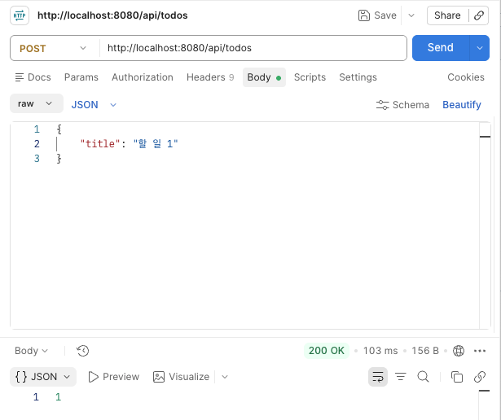
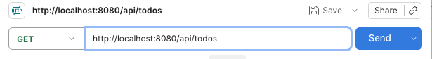
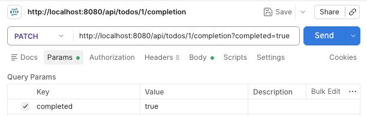
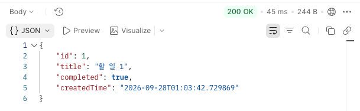
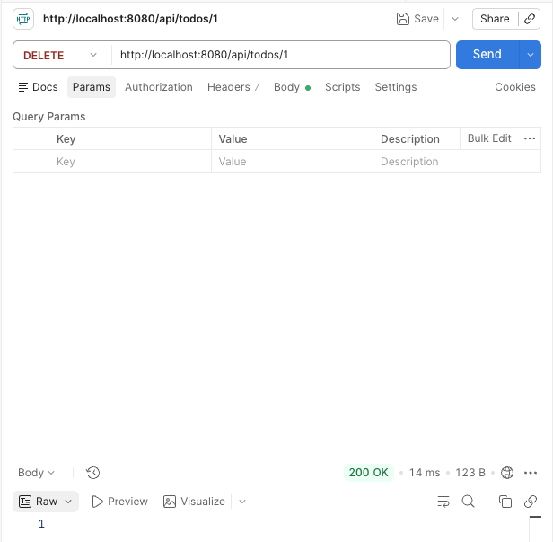
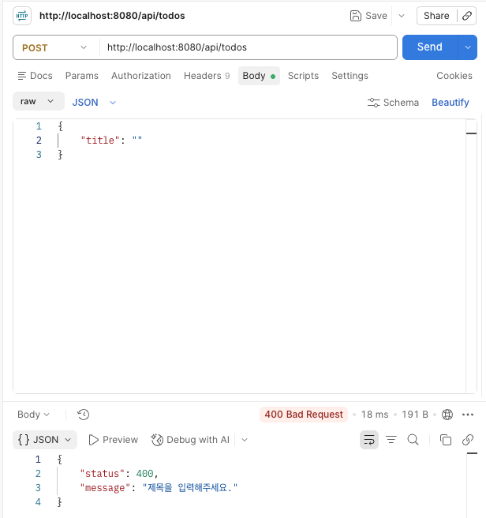
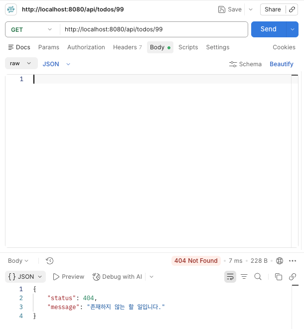

## 1. 실행 방법

**개발 환경**

Java: JDK 21
Framework: Spring Boot 3.5.7
Database: H2
Build Tool: Gradle

DB : H2 데이터베이스

서버 실행
프로젝트 루트 디렉터리에서 다음 명령어를 실행한다.
`./gradlew bootRun`
API 기본 주소: `http://localhost:8080/api/todos`

## 2. API 명세
| 기능 | Method | URL | 상태 코드 |
|---|---|---|---|
| 할 일 생성 | POST | /api/todos | 200 |
| 목록 조회 | GET | /api/todos | 200 |
| 단건 조회 | GET | /api/todos/{id} | 200 |
| 제목 수정 | PUT | /api/todos/{id} | 200 |
| 완료 변경 | PATCH | /api/todos/{id}/completion | 200 |
| 삭제 | DELETE | /api/todos/{id} | 200 |

**요청 및 응답**

#### 1. 할 일 생성 (POST)
요청: POST /api/todos

요청 Body:
```
{
  "title": "할 일 1"
}
```
응답 Body: 생성된 할 일의 ID를 반환한다.


#### 2. 할 일 목록 조회 (GET)
요청: GET /api/todos

응답 Body:
```
[
  {
    "id": 1,
    "title": "할 일 1",
    "completed": false,
    "createdTime": "2026-09-28T01:03:42.729869"
  },
  {
    "id": 2,
    "title": "할 일 2",
    "completed": false,
    "createdTime": "2026-09-28T01:05:24.301962"
  },
  {
    "id": 3,
    "title": "할 일 3",
    "completed": false,
    "createdTime": "2026-09-28T01:05:38.010684"
  }
]
```


#### 3. 할 일 조회 (GET)
요청: GET /api/todos/3

응답 Body: 
```
{
    "id": 3,
    "title": "할 일 3",
    "completed": false,
    "createdTime": "2026-09-28T01:05:38.010684"
}
```


#### 4. 할 일 제목 수정 (PUT)
요청: PUT /api/todos/1

요청 Body:
```
{
  "title": "수정된 제목"
}
```

응답 Body: 
```
{
    "id": 1,
    "title": "수정된 제목",
    "completed": false,
    "createdTime": "2026-09-28T01:03:42.729869"
}
```

#### 5. 할 일 삭제 (DELETE)
요청: DELETE /api/todos/1

응답 Body: 없음

#### 6. 완료 여부 변경 (PATCH)
요청: PATCH /api/todos/1/completion?completed=true

응답 Body: 완료 여부가 변경된 할 일 객체를 반환한다.
```
{
  "id": 2,
  "title": "할 일 2",
  "completed": true,
  "createdTime": "2026-09-28T01:05:24.301962"
}
```
**오류 응답**

모든 오류 응답은 status, message 필드를 사용하는 동일한 JSON 구조로 반환한다.

#### 1. 400 Bad Request — 입력값 검증 실패

{
  "status": 400,
  "message": "제목을 입력해주세요."
}

제목이 비어 있거나 공백으로만 구성된 경우, 또는 100자를 초과하는 경우 400을 반환한다.

#### 2. 404 Not Found — 존재하지 않는 할 일

{
  "status": 404,
  "message": "존재하지 않는 할 일입니다."
}

존재하지 않는 ID로 조회·수정·삭제를 요청하면 404를 반환한다.

500 Internal Server Error — 서버 내부 오류

{
  "status": 500,
  "message": "서버 오류가 발생했습니다."
}

예상하지 못한 서버 오류가 발생한 경우 500을 반환한다.

## 3. 설계 설명
1. API 주소 및 HTTP 메서드
REST API 설계 관례에 따라 할 일이라는 자원을 /api/todos로 표현하고, 개별 할 일은 /api/todos/{id}로 구분한다.
HTTP 메서드는 기능의 목적에 따라 구분한다.
GET: 할 일 조회
POST: 새로운 할 일 생성
PUT: 기존 할 일의 제목 수정
PATCH: 완료 여부만 부분 변경
DELETE: 할 일 삭제

2. HTTP 상태 코드
200 OK: 정상적으로 요청을 처리한 경우
400 Bad Request: 제목이 비어 있거나 길이 제한을 초과한 경우
404 Not Found: 존재하지 않는 할 일을 요청한 경우
500 Internal Server Error: 예상하지 못한 서버 오류가 발생한 경우

3. DB 선택 이유
H2 데이터베이스를 사용했다.
별도의 데이터베이스 서버 설치 없이 실행할 수 있어 개발 환경을 간단하게 구성할 수 있기 때문이다. Todo API의 CRUD 기능을 구현하고 테스트하기에 적합하다.

4. 계층 및 DTO 설계
Controller, Service, Repository로 역할을 분리했다.
Controller: HTTP 요청 및 응답 처리
Service: 할 일 생성·조회·수정·삭제 등 비즈니스 로직 처리
Repository: Spring Data JPA를 이용한 데이터베이스 접근
JPA 엔티티를 API 요청과 응답에 직접 노출하지 않고, TodoRequest와 TodoItemResponse DTO를 사용했다
또한 @NotBlank, @Size, @Valid를 활용하여 잘못된 입력값을 검증하고, GlobalExceptionHandler를 통해 오류 응답의 형식을 통일했다.

## 4. 실행 결과

1. 할 일 만들기
할 일이 생성되면 해당 할 일의 Id를 반환한다.


2. 할 일 목록 조회


3. 완료 처리



4. 할 일 삭제


5. 빈 제목 입력 시 400 오류


6. 없는 할 일을 요청할 경우 404 오류

